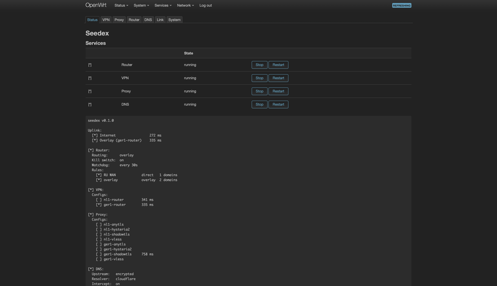
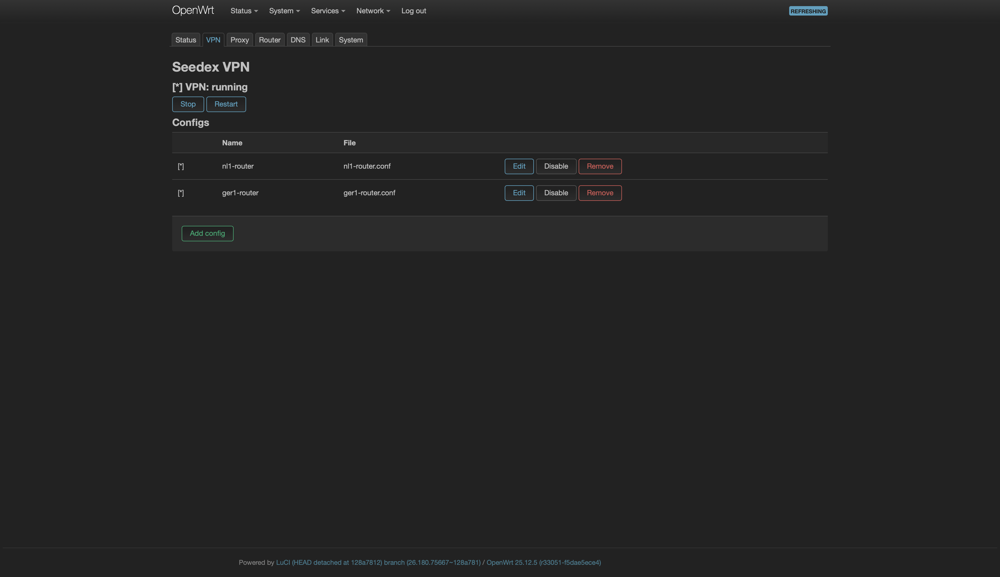
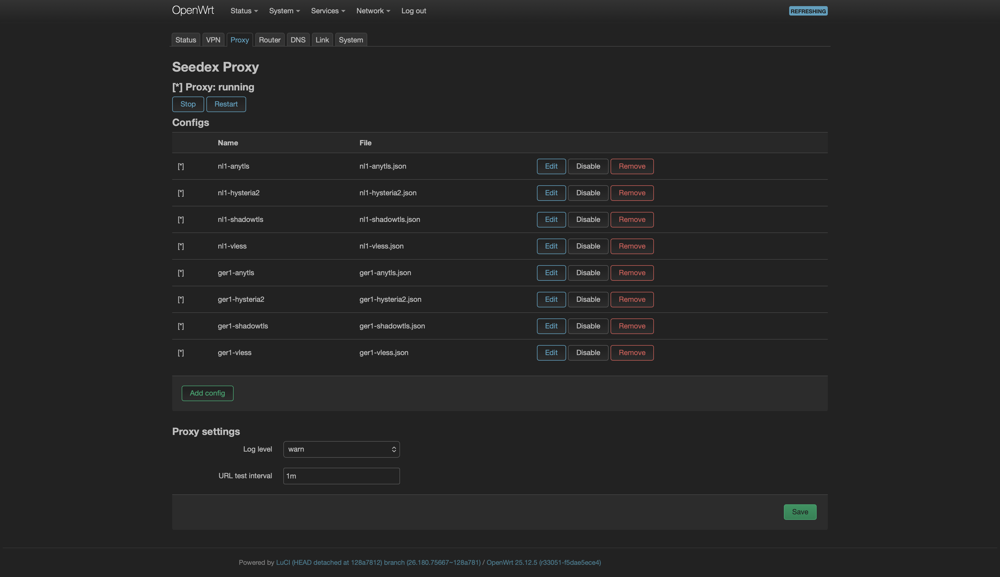
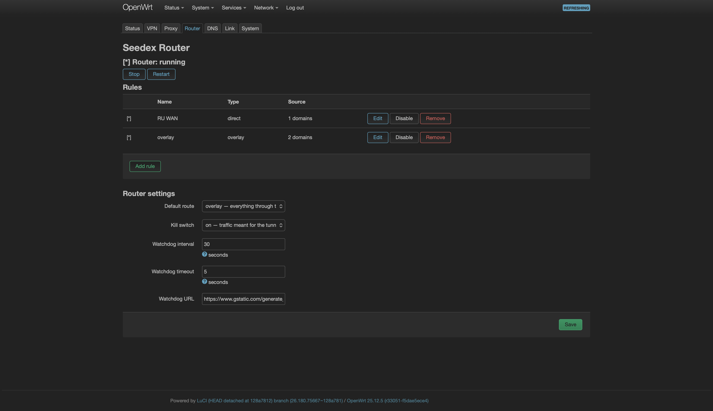
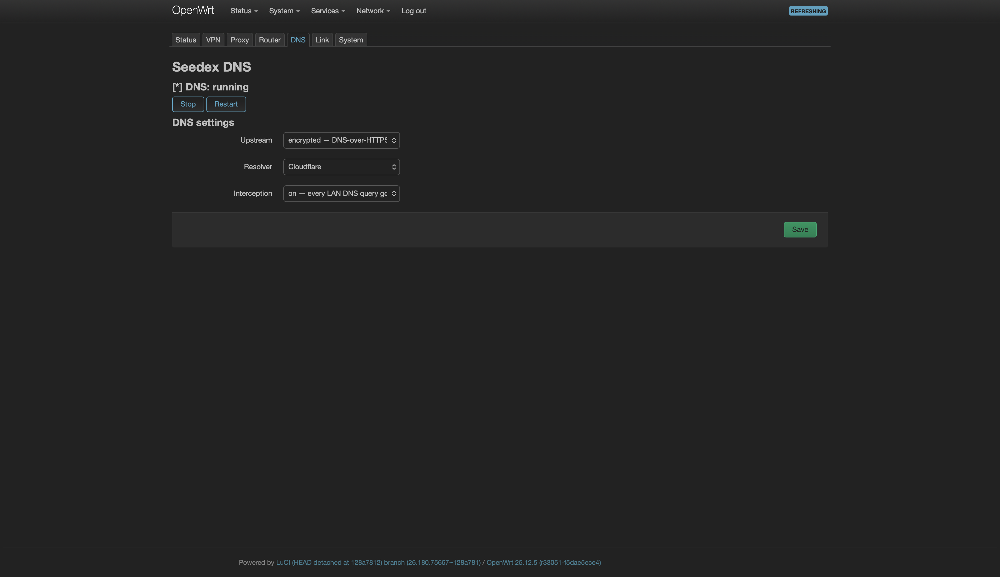
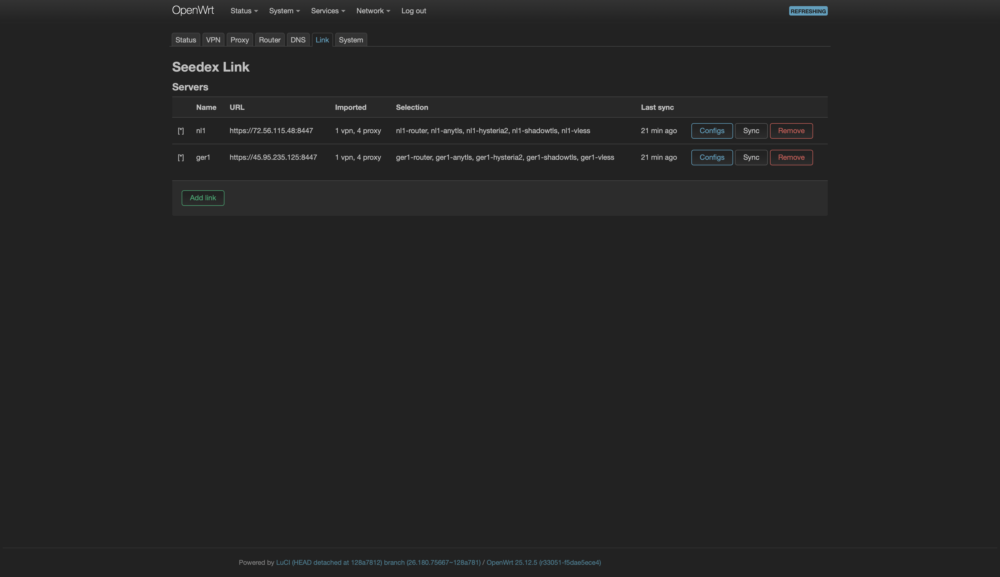
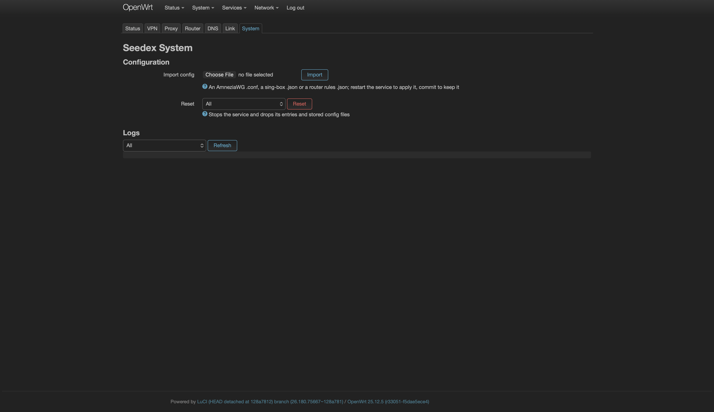

# seedex-box

This page describes the `sdx` command on the router and the LuCI app.

## The `sdx` command

`sdx` is built around four services—`router`, `vpn`, `proxy`, and `dns`—plus `link`, the connection to your servers. Every command follows the same pattern:

* `sdx` shows the status of the router.
* `sdx <service>` shows the status of one service.
* `sdx <service> <action>` runs one action on one service.
* `sdx <action>` runs the same action on every service that has it.
* `sdx <service> help` lists the actions of a service.

### Apply changes

Changes that you make with `sdx`—adding, removing, enabling, updating, and changing settings—are pending until you apply them.

* `sdx apply` saves the pending changes and restarts the affected services.
* `sdx revert` drops the pending changes.
* `sdx changes` shows the pending changes.

Each of these works on one service (`sdx vpn apply`) or on all services. Underneath, this is plain UCI: a `restart` also picks up pending changes.


In LuCI, each Seedex page shows its pending changes with **Apply** and **Revert** buttons. OpenWrt's own **Save & Apply** doesn't see them.


### Address entries

Entries—VPN and proxy configs, and router rules—are addressed by name or by their number in the `show` list. The `show`, `enable`, `disable`, and `remove` actions accept several entries at once.

### Actions of every service

* `sdx <service> start`, `stop`, and `restart` control the service. Without a service, `sdx restart` stops all four services and starts them in order: DNS, the tunnels, and then the router.
* `sdx <service> enable` and `disable` keep the service on or off across reboots. `disable` also stops the service, and `enable` also starts it. With an entry name after the action, the action applies to the entry instead.
* `sdx <service> changes`, `apply`, and `revert` work as described in [Apply changes](#apply-changes).

### Router-wide actions

* `sdx import [--force] <path|link|url>` imports a config file, every config in a directory, a proxy share link, or a subscription address. A WireGuard (WG) or AmneziaWG (AWG) `.conf` file goes to `vpn`, a sing-box `.json` file goes to `proxy`, and a rules `.json` file goes to `router`. The file name becomes the entry name. A name that is already in use is refused, unless you pass `--force`.
  * `--force` replaces the entry of that name with the incoming one, which is how you refresh a subscription or a config you exported again. The entry keeps the state you gave it, so a config you disabled stays disabled. A config that a link manages is never replaced this way: the next sync would undo your file, so change it on the server instead.
  * Links: `vless://`, `trojan://`, `ss://`, `vmess://`, `hysteria2://` (`hy2://`), `tuic://`, and `anytls://`, as clients and panels share them. The link becomes a `proxy` config named after its `#tag`. A text file with one link per line imports every link.
  * Subscriptions: an `http://` or `https://` address is downloaded, then imported as its contents. Panels such as Marzban, 3x-ui, or Hiddify serve the link list base64-encoded, which the importer decodes. Quote the address, since it usually carries a query string:

    ```sh
    sdx import 'https://panel.example.com/sub/<token>'
    ```

    The configs are a snapshot: run the command again to pick up what the panel has changed.
  * Not supported in links: Shadowsocks plugins, VMess header obfuscation, Hysteria port ranges, and `pinSHA256`. Links for TLS protocols usually carry `insecure=1`, which skips certificate checks; a sing-box `.json` with the certificate is the safer form.
* `sdx logs` shows the Seedex lines of the system log. Arguments are passed to `logread`, so `sdx logs -f` follows the log.
* `sdx version` shows the installed package version.

## VPN

The VPN service runs WG and AWG tunnels. Each config is a tunnel of its own: a `.conf` with AWG obfuscation parameters comes up on an `awg` interface, a plain WG `.conf` on a `wg` interface. The router probes all of them and routes through the fastest live tunnel. Traffic enters a tunnel only through the router service, so starting VPN also starts the router and DNS services when they aren't running.

* `sdx vpn` shows whether the service runs and lists every config. `[*]` marks the config that carries traffic. Reachable configs show their RTT.
* `sdx vpn show [#|name ...]` lists the configs with their tunnel interface and file, or shows the named configs with their contents.
* `sdx vpn enable <#|name ...>` and `disable` switch configs on or off without removing them.
* `sdx vpn remove <#|name ...>` removes configs. Their files are deleted at the next start.
* `sdx vpn export` prints every config in a form that `sdx import` accepts.
* `sdx vpn reset` stops the service and drops every config with its files.

## Proxy

The proxy service runs a sing-box tunnel. Every config contributes its outbounds to one sing-box instance, which picks the best outbound by URL test. The router sees the result as a single tunnel next to the VPN tunnels. As with VPN, starting the proxy also starts the router and DNS services when they aren't running.

* `sdx proxy` shows whether the service runs and lists every config. The outbound that sing-box uses shows the tunnel's RTT. `[*]` means that the router routes through the proxy.
* `sdx proxy show [#|name ...]` lists the configs with their files, or shows the named configs with their outbounds.
* `sdx proxy enable <#|name ...>` and `disable` switch configs on or off. sing-box is rebuilt from the enabled configs at the next restart.
* `sdx proxy remove <#|name ...>` removes configs. Their files are deleted at the next start.
* `sdx proxy export` prints every config in a form that `sdx import` accepts.
* `sdx proxy reset` stops the service and drops every config with its files.
* `sdx proxy config show`, `get <key>`, and `set <key>=<value> ...` manage the settings:
  * `log_level`: The sing-box verbosity: `error`, `warn`, `info`, `debug`, or `trace`.
  * `urltest_interval`: How often sing-box re-measures its outbounds, for example `1m`.

## Router

The router service decides where traffic goes: VPN and proxy only provide the tunnels, and the router service steers traffic into them. A default route sends all traffic either through the tunnel or straight to the provider, and rules override it for specific domains, IP addresses, subnets, lists, or devices. A watchdog probes every tunnel and keeps the tunnel traffic on the fastest one. A kill switch makes sure that traffic meant for the tunnel never leaves through the provider in the clear: when no tunnel is up, those connections are blocked until a tunnel comes back.

### Rules

A rule has a `type` that says what happens to the traffic that it matches:

* `overlay` sends the traffic through the tunnel.
* `direct` sends the traffic straight to the provider.
* `block` stops the domains from resolving and blocks connections to the IP addresses.

A rule matches either destinations or devices, never both. Device rules win over destination rules: a device pinned to `direct` stays direct even for domains that other rules send through the tunnel.

A matcher takes one value or several separated by commas and can be repeated.

Destination matchers:

* `domain=<domain>` matches the domain and its subdomains.
* `ip=<address or CIDR>` matches an IP address or range.
* `list_url=<url>` matches a text file with one domain or IP address per line. The file is downloaded when the service starts and then every `list_refresh` (for example `12h` or `1d`). Hosts-style files are accepted as they are.
* `list_path=<file>` matches the same kind of file from the router's file system.

Device matchers:

* `client_mac=<aa:bb:cc:dd:ee:ff>` matches every packet from that device.
* `client_ip=<address or CIDR>` matches every packet from that address or subnet: a guest VLAN, a device with a static address, or a client behind another router.

Examples:

```sh
sdx router add youtube type=overlay domain=youtube.com domain=googlevideo.com
sdx router add ads type=block list_url=https://raw.githubusercontent.com/StevenBlack/hosts/master/hosts list_refresh=1d
sdx router add tv type=direct client_mac=aa:bb:cc:dd:ee:ff
sdx router add guests type=direct client_ip=10.0.20.0/24
```


Ready-made lists by service, such as YouTube or Telegram, are at [iplist.opencck.org](https://iplist.opencck.org): pick a service and the text format, and give the URL to `list_url`, quoted because of the `&`. A rule holds one list; the domains and the IP ranges of a service are separate lists, so they take two rules. For example, YouTube through a tunnel:

```sh
sdx router add youtube type=overlay list_url='https://iplist.opencck.org/?format=text&data=domains&site=youtube.com' list_refresh=1d
sdx router add youtube-ip type=overlay list_url='https://iplist.opencck.org/?format=text&data=cidr4&site=youtube.com' list_refresh=1d
```


### Commands

* `sdx router` shows whether the service runs, the routing mode, the kill switch, the watchdog interval, and the rules.
* `sdx router show [#|name ...]` lists the rules, or shows every field of the named rules.
* `sdx router add <name> type=... [matchers]` adds a rule.
* `sdx router update <#|name> ...` changes a rule. It accepts `type=`, `name=`, and the list options, and edits the matcher lists `domain`, `ip`, `client_mac`, and `client_ip`:
  * `domain=<values>` replaces the list. An empty `domain=` empties it.
  * `add-domain=` adds to the list.
  * `del-domain=` removes from the list.
  * The same forms work for `ip`, `client_mac`, and `client_ip`.
* `sdx router enable <#|name ...>` and `disable` switch rules on or off.
* `sdx router remove <#|name ...>` removes rules.
* `sdx router export` prints the rules as JSON that `sdx import` accepts.
* `sdx router reset` stops the service and drops every rule.
* `sdx router config show`, `get <key>`, and `set <key>=<value> ...` manage the settings:
  * `default_route`: Where unmatched traffic goes: `overlay` or `direct`.
  * `kill_switch`: `1` blocks tunnel traffic when no tunnel is up. `0` lets it out through the provider in the clear.
  * `watchdog_interval`: The number of seconds between probes of the tunnels.
  * `watchdog_url`: The URL that the probes fetch.
  * `watchdog_timeout`: The number of seconds before a probe counts as failed.

## DNS

The DNS service is the resolver of the whole network. Queries leave encrypted, and through the tunnel when one is up. Devices that try to resolve on their own are answered by the router anyway.

* `sdx dns` shows whether the service runs, the upstream, the resolver, and whether interception is on.
* `sdx dns config show`, `get <key>`, and `set <key>=<value> ...` manage the settings:
  * `upstream`: Where the router sends queries.
    * `encrypted` uses DNS-over-HTTPS to the resolver: through the tunnel when one is up, and over the provider's line otherwise.
    * `plain` uses the resolver's classic DNS over the same path.
    * `provider` uses whatever the provider handed out, untouched.
  * `resolver`: `cloudflare`, `quad9`, or `google`. Ignored with `provider`.
  * `intercept`: `1` redirects every DNS query from the network into the router and refuses DNS-over-TLS, so that a device with its own resolver still follows the rules. `0` leaves devices alone.

## Link

A link is the connection to a server that runs seedex-agent. You pair once. From then on, the router pulls its VPN and proxy configs from the server every 30 minutes and on demand. Configs that a link delivers are ordinary `vpn` and `proxy` entries marked as managed by that link: the link updates them, removes them when the server drops them, and leaves configs that you imported by hand alone.

* `sdx link` lists every link: whether the last sync succeeded, the URL, how many configs the link manages, and when it last synced.
* `sdx link add <name> <url> <token> <fingerprint>` pairs with a server. `sdx link add <router>` on the server prints the exact command. The fingerprint pins the server's certificate, and the token identifies the router. When the server offers configs, the command continues with `sdx link select` so that you can pick the ones to import.
* `sdx link show <name>` lists what the server offers. `[*]` marks the configs that the router has imported.
* `sdx link select <name> [<config> ... | --all]` chooses which of the offered configs to import. Without arguments, the command opens a menu: move with the arrow keys, toggle a config with Space, select all with `a`, clear with `n`, confirm with Enter, or cancel with `q`. With names, the command selects those configs. `--all` imports everything that the server offers, including configs added later. The choice is kept. Deselected configs are removed and selected configs are added as pending changes, which `sdx apply` saves and applies. Nothing is imported until you select something.
* `sdx link sync [<name>]` pulls the configs for one link or for all links. Changed configs are replaced, added configs are imported, dropped configs are removed, and the services that changed are restarted.
* `sdx link <name> [<command> ...]` runs the server's own `sdx`. For example, `sdx link agent` shows the server's status, `sdx link agent vpn add phone` adds a client, and `sdx link agent proxy add vless 443` adds a protocol. When a command changes the configs, the router syncs right away. The server accepts only `vpn` and `proxy` actions and `start`, `stop`, and `restart`. Its own `link` and `firewall` commands stay out of reach.
* `sdx link remove <name>` unpairs and drops every config that the link delivered.

## LuCI

The **Services > Seedex** menu mirrors `sdx`. Each page shows **Unsaved changes** with **Apply** and **Revert** buttons, and **Changes not applied yet** when the service runs with older settings than the saved ones.

### Status

Shows the services with **Stop** and **Restart** buttons, and the output of `sdx`.



### VPN

Manages the VPN configs: add, edit, enable, disable, and remove.



### Proxy

Manages the proxy configs the same way, and the sing-box settings.



### Router

Manages the rules and the router settings.



### DNS

Manages the DNS settings: upstream, resolver, and interception.



### Link

Manages the servers: add, remove, sync, and pick the configs to import.



### System

Imports a config file, resets a service, and shows the logs.


