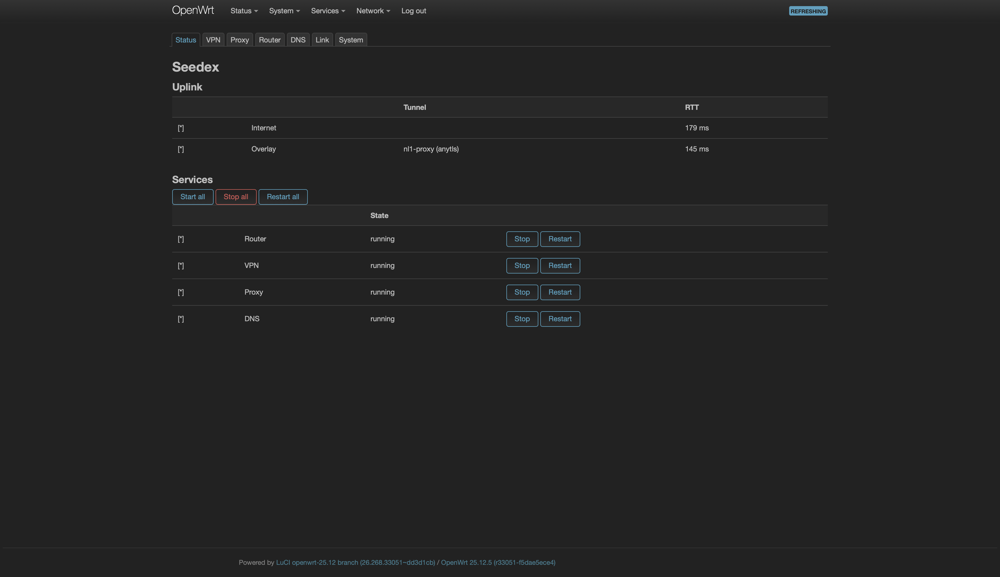
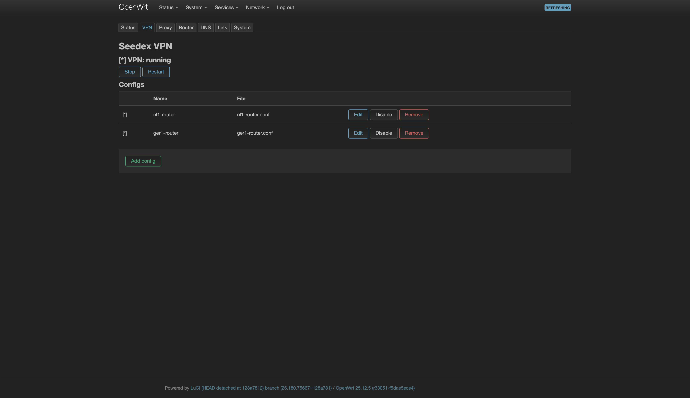
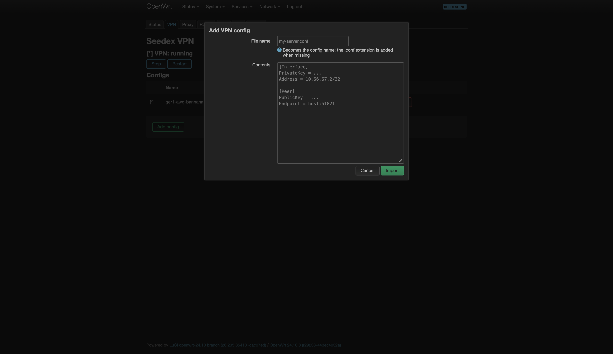
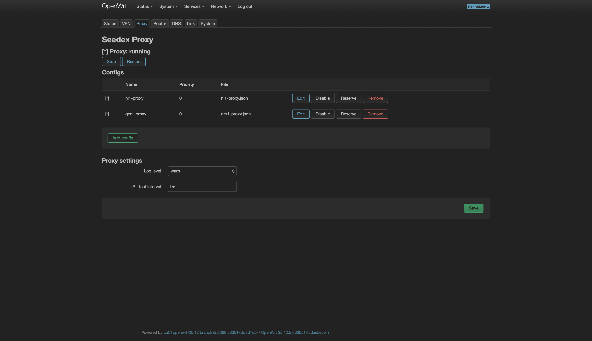
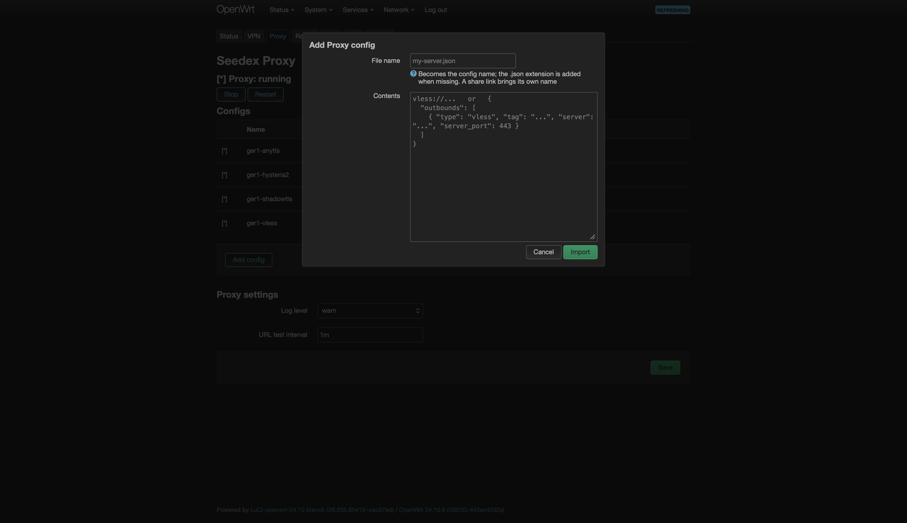
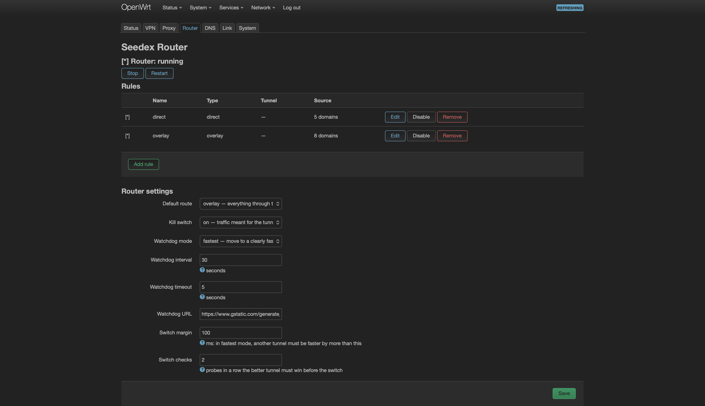
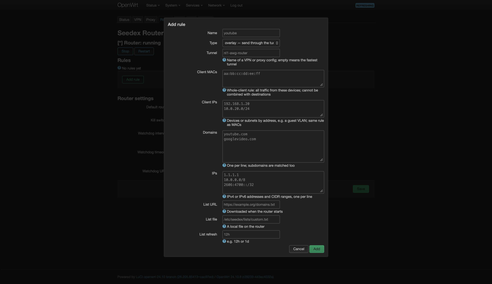
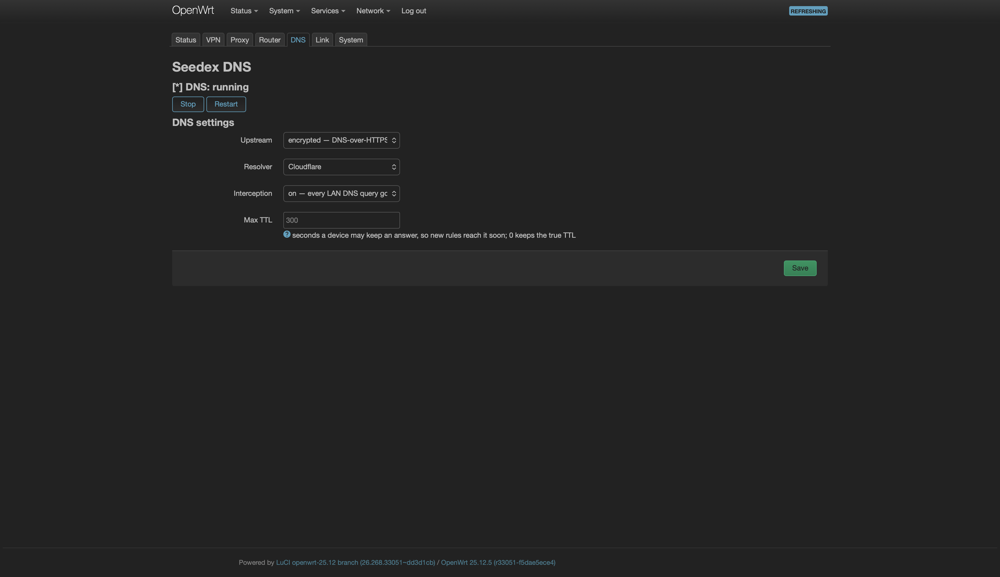
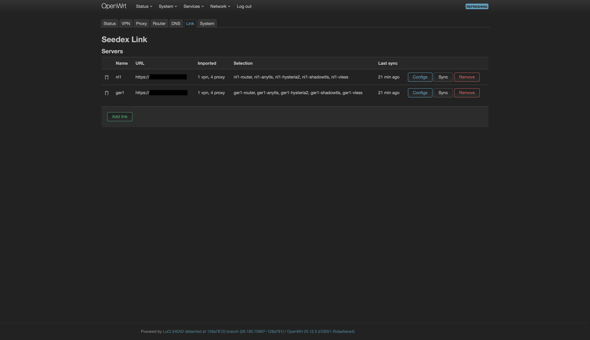
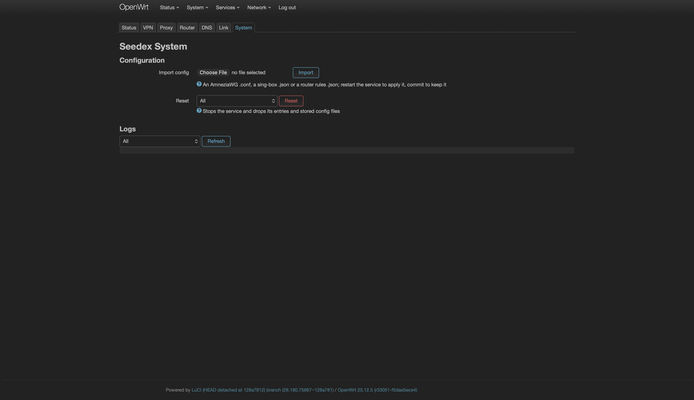

# seedex-box

Эта страница описывает команду `sdx` на роутере и приложение для LuCI.

## Команда `sdx`

`sdx` построен вокруг четырёх сервисов — `router`, `vpn`, `proxy` и `dns` — и `link`, связи с вашими серверами. Каждая команда следует одному шаблону:

* `sdx` показывает статус роутера.
* `sdx <service>` показывает статус одного сервиса.
* `sdx <service> <action>` выполняет одно действие над одним сервисом.
* `sdx <action>` выполняет то же действие над каждым сервисом, у которого оно есть.
* `sdx <service> help` перечисляет действия сервиса.

### Применение изменений

Изменения, которые вы вносите через `sdx`, — добавление, удаление, включение, правка и настройки — ожидают применения.

* `sdx apply` сохраняет ожидающие изменения и перезапускает затронутые сервисы.
* `sdx revert` отменяет ожидающие изменения.
* `sdx changes` показывает ожидающие изменения.

Каждая из этих команд работает с одним сервисом (`sdx vpn apply`) или со всеми. Под капотом это обычный UCI: `restart` тоже подхватывает ожидающие изменения.


В LuCI каждая страница Seedex показывает свои ожидающие изменения с кнопками **Apply** и **Revert**. Штатный **Save & Apply** OpenWrt их не видит.


### Адресация записей

Записи — конфиги VPN и proxy и правила router — адресуются по имени или по номеру в списке `show`. Действия `show`, `enable`, `disable` и `remove` принимают несколько записей сразу.

### Действия каждого сервиса

* `sdx <service> start`, `stop` и `restart` управляют сервисом. Без сервиса `sdx restart` останавливает все четыре сервиса и запускает их по порядку: DNS, туннели, затем Router.
* `sdx <service> enable` и `disable` держат сервис включённым или выключенным между перезагрузками. `disable` заодно останавливает сервис, `enable` — запускает. Если после действия указано имя записи, действие применяется к записи, а не к сервису.
* `sdx <service> changes`, `apply` и `revert` работают так, как описано в разделе «Применение изменений».

### Действия роутера в целом

* `sdx priority [<config> [<number>]]` задаёт приоритет конфига VPN или Proxy для режимов watchdog `priority` и `failover`: чем больше число, тем охотнее выбирается туннель; по умолчанию 0, отрицательные числа допустимы. Без числа команда показывает приоритет, без конфига — перечисляет все. Watchdog учитывает новый приоритет на ближайшей проверке, без `sdx apply`.
* `sdx reserve <config> ...` убирает туннель из overlay: его используют только правила, закреплённые за ним через `iface=` — рабочий VPN остаётся для рабочего трафика, даже когда он самый быстрый. `sdx unreserve` возвращает его в общий выбор. Обе команды действуют сразу, без `sdx apply`.
* `sdx import [--force] <path|link|url>` импортирует файл конфига, все конфиги из каталога, ссылку на прокси, адрес подписки. Файл `.conf` WireGuard (WG) или AmneziaWG (AWG) идёт в `vpn`, файл `.json` sing-box — в `proxy`, файл `.json` с правилами — в `router`. Имя файла становится именем записи. Занятое имя отклоняется, если не передан `--force`.
  * `--force` заменяет запись с таким именем на новую — так обновляют подписку либо заново выгруженный конфиг. Как и любое другое изменение, замена ждёт `sdx apply`: новый файл лежит рядом со старым под именем `<name>.new`, работающий сервис продолжает читать старый, а `sdx revert` удаляет новый. Запись сохраняет состояние, которое вы ей задали: выключенный конфиг останется выключенным. Конфиг, которым управляет линк, так заменить нельзя — ближайшая синхронизация отменила бы вашу правку, поэтому меняйте его на сервере.
  * Файл с правилами отклоняется так же, если в нём есть имя существующего правила. Проверка идёт по всему файлу сразу, поэтому импорт не оставит половину правил применёнными.
  * Ссылки: `vless://`, `trojan://`, `ss://`, `vmess://`, `hysteria2://` (`hy2://`), `tuic://` и `anytls://` — в том виде, в каком ими делятся клиенты и панели. Ссылка становится конфигом `proxy` с именем из `#tag`. Текстовый файл, в котором по одной ссылке на строку, импортирует все ссылки.
  * Подписки: адрес `http://` или `https://` скачивается, дальше импортируется его содержимое. Панели вроде Marzban, 3x-ui или Hiddify отдают список ссылок в base64 — импорт его раскодирует. Адрес берите в кавычки, обычно в нём есть строка запроса:

    ```sh
    sdx import 'https://panel.example.com/sub/<token>'
    ```

    Конфиги остаются снимком: чтобы забрать изменения панели, повторите команду с `--force`. Серверы, которых в панели больше нет, останутся на роутере — удалите их командой `sdx proxy remove`.
  * В ссылках не поддерживаются: плагины Shadowsocks, обфускация заголовков VMess, диапазоны портов Hysteria и `pinSHA256`. Ссылки для TLS-протоколов обычно несут `insecure=1`, что отключает проверку сертификата; `.json` sing-box с сертификатом — более безопасная форма.
* `sdx logs` показывает строки Seedex из системного лога. Аргументы передаются в `logread`, так что `sdx logs -f` следит за логом.
* `sdx version` показывает версию установленного пакета.

## VPN

Сервис VPN держит туннели WG и AWG. Каждый конфиг — отдельный туннель: `.conf` с параметрами обфускации AWG поднимается на интерфейсе `awg`, обычный `.conf` WG — на интерфейсе `wg`. Роутер проверяет все и ведёт трафик через самый быстрый живой туннель. Трафик попадает в туннель только через сервис Router, поэтому запуск VPN заодно запускает сервисы Router и DNS, если они не работают.

* `sdx vpn` показывает, работает ли сервис, и перечисляет каждый конфиг. `[*]` отмечает конфиг, несущий трафик. Доступные конфиги показывают RTT, а убранный из overlay помечен словом `reserved`.
* `sdx vpn show [#|name ...]` перечисляет конфиги с интерфейсом туннеля и файлом или показывает названные конфиги с содержимым.
* `sdx vpn enable <#|name ...>` и `disable` включают или выключают конфиги, не удаляя их.
* `sdx vpn remove <#|name ...>` удаляет конфиги. Их файлы удаляются при следующем запуске.
* `sdx vpn export` печатает каждый конфиг в виде, который принимает `sdx import`.
* `sdx vpn reset` останавливает сервис и удаляет каждый конфиг вместе с файлами.

## Proxy

Сервис Proxy держит один экземпляр sing-box, в котором у каждого конфига свой интерфейс-туннель: `proxy0`, `proxy1` и далее. Роутер обращается с ними так же, как с туннелями VPN: проверяет каждый, ведёт трафик через самый быстрый, умеет закрепить за любым из них правило. Конфиг сервера seedex-agent несёт все его протоколы. Внутри sing-box меряет их URL-тестом и держит интерфейс на самом быстром, а для роутера такой конфиг остаётся одним туннелем: watchdog пишет RTT через его интерфейс, `priority`, `reserve` и `iface=` относятся к нему целиком. Так же работает любой конфиг с несколькими outbound-ами. Имена резолвит DNS-сервис роутера. Как и с VPN, запуск Proxy заодно запускает сервисы Router и DNS, если они не работают.

* `sdx proxy` показывает, работает ли сервис, и перечисляет каждый конфиг с его RTT. `[*]` отмечает конфиг, который несёт трафик, `reserved` — убранный из overlay. У конфига с несколькими протоколами в скобках после имени указан тот, через который sing-box ведёт трафик сейчас, например `ger1-proxy (vless)`.
* `sdx proxy show [#|name ...]` перечисляет конфиги с файлами или показывает outbound-ы названных конфигов.
* `sdx proxy enable <#|name ...>` и `disable` включают или выключают конфиги. sing-box пересобирается из включённых конфигов при следующем перезапуске.
* `sdx proxy remove <#|name ...>` удаляет конфиги. Их файлы удаляются при следующем запуске.
* `sdx proxy export` печатает каждый конфиг в виде, который принимает `sdx import`.
* `sdx proxy reset` останавливает сервис и удаляет каждый конфиг вместе с файлами.
* `sdx proxy config show`, `get <key>` и `set <key>=<value> ...` управляют настройками:
  * `log_level`: подробность sing-box: `error`, `warn`, `info`, `debug` или `trace`.
  * `urltest_interval`: как часто sing-box перемеряет протоколы внутри конфига, например `1m`. Для проверки он запрашивает `watchdog_url` роутера.

## Router

Сервис Router решает, куда идёт трафик: VPN и Proxy только поднимают туннели, а Router направляет в них трафик. Маршрут по умолчанию отправляет весь трафик либо через overlay, либо напрямую к провайдеру, а правила переопределяют его для отдельных доменов, IP-адресов, подсетей, списков или устройств. Watchdog проверяет каждый туннель и направляет overlay-трафик через живой: самый быстрый, с наибольшим приоритетом или текущий до его отказа. Kill switch следит, чтобы трафик, который должен идти через overlay, не ушёл к провайдеру открытым, когда ни один overlay-туннель не поднят: такие соединения блокируются до появления живого туннеля. Явно прямые правила по-прежнему идут через WAN.

Если провайдер не даёт IPv6, а активный туннель его везёт, Router объявляет устройствам в LAN маршрут IPv6 по умолчанию (`ra_default` в `dhcp.lan`). Так через overlay открываются и сайты, доступные только по IPv6. Когда туннель перестаёт везти IPv6 или Router останавливается, объявление снимается. Значение `ra_default`, выставленное вручную, Router не трогает.

### Правила

У правила есть `type`, который говорит, что происходит с совпавшим трафиком:

* `overlay` отправляет трафик через туннель.
* `direct` отправляет трафик напрямую к провайдеру.
* `block` запрещает резолвить домены и блокирует соединения с IP-адресами.

Правило совпадает либо по назначению, либо по устройству, но не по обоим сразу. Правила по устройству сильнее правил по назначению: устройство, закреплённое за `direct`, остаётся direct даже для доменов, которые другие правила отправляют в туннель.

`iface=<конфиг>` закрепляет правило `overlay` за одним туннелем по имени его конфига VPN или Proxy, вместо самого быстрого. Закреплённые правила проверяются раньше остальных, уступая только правилам устройств типа `direct`. Когда watchdog находит этот туннель недоступным, трафик правила идёт по маршруту overlay по умолчанию, пока тот не ответит снова; kill switch при этом действует. Закреплённый туннель остаётся в общем выборе, пока его не убрать через `reserve`:

```sh
sdx router add work type=overlay iface=ger1-awg-router domain=intranet.example.com
sdx router update work iface=
```

Матчер принимает одно значение или несколько через запятую, и его можно повторять.

Матчеры по назначению:

* `domain=<domain>` совпадает с доменом и его поддоменами.
* `ip=<address or CIDR>` совпадает с IP-адресом или диапазоном.
* `list_url=<url>` совпадает с текстовым файлом, в котором по одному домену или IP-адресу на строку. Файл загружается при старте сервиса и затем каждые `list_refresh` (например `12h` или `1d`). Файлы в формате hosts принимаются как есть.
* `list_path=<file>` совпадает с таким же файлом из файловой системы роутера.

Матчеры по устройству:

* `client_mac=<aa:bb:cc:dd:ee:ff>` совпадает с каждым пакетом от этого устройства.
* `client_ip=<address or CIDR>` совпадает с каждым пакетом с этого адреса или подсети: гостевой VLAN, устройство со статическим адресом или клиент за другим роутером.

Примеры:

```sh
sdx router add youtube type=overlay domain=youtube.com domain=googlevideo.com
sdx router add ads type=block list_url=https://raw.githubusercontent.com/StevenBlack/hosts/master/hosts list_refresh=1d
sdx router add tv type=direct client_mac=aa:bb:cc:dd:ee:ff
sdx router add guests type=direct client_ip=10.0.20.0/24
```


Готовые списки по сервисам, например YouTube или Telegram, есть на [iplist.opencck.org](https://iplist.opencck.org): выберите сервис и текстовый формат и передайте URL в `list_url` — в кавычках из-за `&`. В правиле один список; домены и диапазоны IP-адресов сервиса — разные списки, поэтому им нужны два правила. Например, YouTube через туннель:

```sh
sdx router add youtube type=overlay list_url='https://iplist.opencck.org/?format=text&data=domains&site=youtube.com' list_refresh=1d
sdx router add youtube-ip type=overlay list_url='https://iplist.opencck.org/?format=text&data=cidr4&site=youtube.com' list_refresh=1d
```


### Команды

* `sdx router` показывает, работает ли сервис, режим маршрутизации, kill switch, режим watchdog и правила.
* `sdx router show [#|name ...]` перечисляет правила или показывает каждое поле названных правил.
* `sdx router add <name> type=... [matchers]` добавляет правило.
* `sdx router update <#|name> ...` меняет правило. Команда принимает `type=`, `name=` и опции списка и редактирует списки матчеров `domain`, `ip`, `client_mac` и `client_ip`:
  * `domain=<values>` заменяет список. Пустое `domain=` очищает его.
  * `add-domain=` добавляет в список.
  * `del-domain=` удаляет из списка.
  * Те же формы работают для `ip`, `client_mac` и `client_ip`.
* `sdx router enable <#|name ...>` и `disable` включают или выключают правила.
* `sdx router remove <#|name ...>` удаляет правила.
* `sdx router export` печатает правила в JSON, который принимает `sdx import`.
* `sdx router reset` останавливает сервис и удаляет каждое правило.
* `sdx router config show`, `get <key>` и `set <key>=<value> ...` управляют настройками:
  * `default_route`: куда идёт несовпавший трафик: `overlay` или `direct`.
  * `kill_switch`: `1` блокирует трафик, назначенный для overlay, когда ни один overlay-туннель не поднят. `0` пускает этот трафик к провайдеру открытым.
  * `watchdog_interval`: число секунд между проверками туннелей.
  * `watchdog_url`: URL, который запрашивают проверки. Его же использует `urltest` в Proxy, поэтому после смены `sdx router apply` перезапускает Proxy, если там есть конфиг с несколькими outbound-ами.
  * `watchdog_timeout`: число секунд, после которых проверка считается неудачной.
  * `watchdog_mode`: как watchdog выбирает туннель. Он сравнивает медиану RTT последних трёх проверок, а туннель, который перестал отвечать, покидает сразу.
    * `fastest` (по умолчанию) переходит на туннель, который быстрее больше чем на `watchdog_tolerance` в `watchdog_checks` проверках подряд. Приоритеты не учитываются.
    * `priority` переходит на туннель с более высоким приоритетом (см. `sdx priority`), когда тот ответил в `watchdog_checks` проверках подряд, и никогда — ради скорости.
    * `failover` не уходит с текущего туннеля, пока тот отвечает, поэтому открытые соединения не рвутся.

    Когда текущий туннель отказал, `fastest` берёт самый быстрый из отвечающих, а `priority` и `failover` — с наибольшим приоритетом, а среди равных — самый быстрый.
  * `watchdog_tolerance`: на сколько миллисекунд быстрее должен быть другой туннель в режиме `fastest`, по умолчанию 100.
  * `watchdog_checks`: сколько проверок подряд должен выиграть лучший туннель до переключения, по умолчанию 3. При интервале 30 секунд это полторы минуты.

`sdx router apply` применяет правки правил на ходу. Таблица, маршрут и туннели остаются на месте, а dnsmasq перезапускается, только если изменились домены. Адреса домена, добавленного вручную, попадают в правило сразу. Его поддомены начинают совпадать, когда клиент запросит их заново, то есть не позже `max_ttl` сервиса DNS. Чтобы не ждать, очистите кэш DNS на устройстве или перезапустите браузер. Удаление домена очищает адреса остальных доменов того же типа, и они набираются заново: клиент, который держит адрес в кэше, какое-то время ходит мимо правила. Настройки `watchdog_*` вступают в силу на ближайшей проверке, а смена `default_route` или `kill_switch` перезапускает сервис.

`sdx router restart` держит правила и маршрут, пока их не заменит новый запуск, поэтому трафик не уходит мимо туннеля.

## DNS

Сервис DNS — резолвер всей сети. Запросы уходят зашифрованными, а когда туннель поднят — через туннель, при любом маршруте по умолчанию. Так провайдер не может ни заблокировать DNS, ни подменить ответы для заблокированных сайтов. Пока ни один туннель не поднят, DNS идёт по линии провайдера: роутеру нужно резолвить, чтобы поднять туннели. При включённом перехвате роутер обрабатывает обычные DNS-запросы устройств, которые пытаются резолвить сами.

* `sdx dns` показывает, работает ли сервис, upstream, резолвер, перехват и `max_ttl`.
* `sdx dns config show`, `get <key>` и `set <key>=<value> ...` управляют настройками:
  * `upstream`: куда роутер отправляет запросы.
    * `encrypted` использует DNS-over-HTTPS к резолверу: через туннель, когда он поднят, иначе по линии провайдера.
    * `plain` использует классический DNS резолвера тем же путём.
    * `provider` использует то, что выдал провайдер, без изменений и всегда по линии провайдера: его DNS отвечает только своим абонентам. На заблокированный сайт провайдер может ответить адресом своей заглушки, поэтому правила overlay по доменам для заблокированных сайтов с `provider` не работают.
  * `resolver`: `cloudflare`, `quad9` или `google`. С `provider` не используется.
  * `intercept`: `1` перенаправляет DNS на порту 53 из сети в роутер и отклоняет DNS-over-TLS на порту 853. Произвольный DNS-over-HTTPS прозрачно перехватить нельзя, поэтому устройство со своим DoH-резолвером может обходить правила по доменам. `0` не трогает устройства.
  * `max_ttl`: сколько секунд устройство может держать ответ в кэше, по умолчанию 300. После правки правил устройства переспросят адреса не позже этого срока, а до тех пор новое правило по домену их обходит. dnsmasq хранит настоящий TTL у себя, поэтому запросов к upstream больше не становится. `0` отдаёт настоящий TTL.


Чтобы клиенты с известными DoH-эндпоинтами перешли на DNS роутера, добавьте правило Router типа `block` для доменов этих эндпоинтов. Используйте записи `domain=` или список через `list_url`/`list_path`, например `dns.google`, `cloudflare-dns.com` и конкретные хосты под `doh.*`. Исключите резолвер самого роутера: блокировка `cloudflare-dns.com` при `resolver=cloudflare`, например, сломает его шифрованный upstream. Способ работает только с известными доменными эндпоинтами: клиент всё ещё может использовать неизвестный эндпоинт или жёстко заданный IP-адрес.



Помимо резолвера сервиса DNS dnsmasq спрашивает и серверы из `/etc/config/dhcp` (`list server` в секции `dnsmasq`). Они получают обычный DNS через туннель, а не DNS-over-HTTPS, и их ответы смешиваются с ответами резолвера. Чтобы `encrypted` был единственным upstream, удалите их: `uci delete dhcp.@dnsmasq[0].server; uci commit dhcp; /etc/init.d/dnsmasq restart`.


## Link

Линк — связь с сервером, на котором работает seedex-agent. Вы соединяетесь один раз. Дальше роутер забирает с сервера выбранные для этого линка конфиги VPN и Proxy каждые 30 минут и по запросу. Конфиги, которые принёс линк, — обычные записи `vpn` и `proxy`, помеченные как управляемые этим линком: линк обновляет их, удаляет, когда сервер их убрал, и не трогает конфиги, которые вы импортировали вручную.

Сервер предлагает один proxy-конфиг, `<сервер>-proxy`, со всеми протоколами. Раньше он предлагал по конфигу на протокол, `<сервер>-<протокол>`. Первая синхронизация после обновления сервера переносит на новый конфиг выбор, правила с `iface=`, наибольший `priority` старых и `reserve`, если были зарезервированы все. Старые записи затем удаляются. Обновите роутер раньше сервера: старый роутер не знает о переносе и потеряет proxy-конфиги этого линка, пока вы не выберете новый через `sdx link select`.


Токен роутера — это полный доступ к VPN и Proxy сервера. Один сервер — один круг доверия: не связывайте с одним сервером роутеры, которым не доверяете по отношению друг к другу. Link не открывает команды сервера `firewall` и `link`, но это не делает токен средством изоляции недоверенных роутеров.


* `sdx link` перечисляет каждый линк: удалась ли последняя синхронизация, URL, сколькими конфигами линк управляет и когда синхронизировался в последний раз.
* `sdx link add <name> <url> <token> <fingerprint>` соединяется с сервером. `sdx link add <router>` на сервере печатает точную команду. Отпечаток закрепляет сертификат сервера, токен идентифицирует роутер. Когда сервер предлагает конфиги, команда переходит в `sdx link select`, чтобы вы выбрали, какие импортировать.
* `sdx link show <name>` перечисляет, что предлагает сервер. `[*]` отмечает конфиги, которые роутер импортировал.
* `sdx link select <name> [<config> ... | --all]` выбирает, какие из предложенных конфигов импортировать. Без аргументов команда открывает меню: перемещайтесь стрелками, отмечайте конфиг пробелом, выберите все клавишей `a`, снимите выбор клавишей `n`, подтвердите клавишей Enter или отмените клавишей `q`. С именами команда выбирает эти конфиги. `--all` импортирует всё, что предлагает сервер, включая конфиги, добавленные позже. Выбор запоминается. Снятые с выбора конфиги удаляются, выбранные добавляются как ожидающие изменения, которые `sdx apply` сохраняет и применяет. Пока вы ничего не выбрали, ничего не импортируется.
* `sdx link sync [<name>]` забирает конфиги для одного линка или для всех. Изменившиеся конфиги заменяются, добавленные импортируются, убранные удаляются, изменившиеся сервисы перезапускаются.
* `sdx link <name> [<command> ...]` запускает разрешённую команду серверного `sdx`. Например, `sdx link agent` показывает статус сервера, `sdx link agent vpn add phone` добавляет клиента, `sdx link agent proxy add vless 443` добавляет протокол. Когда команда меняет конфиги, роутер сразу синхронизируется. Сервер принимает статус, `help`, `version` и общие `start`, `stop`, `restart`; для `vpn` и `proxy` также доступны `config`, `rotate`, `add` и `remove`. Его собственные команды `link` и `firewall` недоступны.
* `sdx link remove <name>` разрывает связь и удаляет каждый конфиг, который принёс линк.

## LuCI

Меню **Services > Seedex** повторяет `sdx`. Каждая страница показывает **Unsaved changes** с кнопками **Apply** и **Revert**, а также **Changes not applied yet**, когда сервис работает с более старыми настройками, чем сохранённые.

### Status

Раздел **Uplink** показывает линию провайдера и туннель, через который идёт overlay, с RTT. У proxy-конфига в скобках указан протокол, выбранный sing-box. Раздел **Services** перечисляет сервисы с кнопками **Start**, **Stop** и **Restart**. Кнопки **Start all**, **Stop all** и **Restart all** управляют всеми сервисами сразу, как `sdx start`, `sdx stop` и `sdx restart`.



### VPN

Управляет конфигами VPN: добавить, изменить, включить, выключить, удалить, а кнопки Reserve и Unreserve убирают туннель из overlay либо возвращают обратно. В окне изменения задаётся приоритет туннеля.



Чтобы добавить VPN-конфиг, нажмите **Add config**, укажите имя файла, вставьте содержимое файла `.conf` WG или AWG и нажмите **Import**. Если расширения `.conf` нет, оно добавится.



### Proxy

Управляет конфигами Proxy так же, с той же кнопкой **Reserve**, а также настройками sing-box.



Чтобы добавить прокси-конфиг, нажмите **Add config** и либо вставьте поддерживаемую прокси-ссылку, либо укажите имя файла и вставьте JSON-конфиг sing-box. Ссылка сама задаёт имя; если в имени файла нет `.json`, расширение добавится.



### Router

Управляет правилами и настройками Router.



Чтобы добавить правило, нажмите **Add rule**, выберите тип и заполните матчеры по назначению или устройству. Сочетать оба вида в одном правиле нельзя. Оставьте поле **Tunnel** пустым, чтобы использовать самый быстрый живой overlay-туннель, либо укажите имя конфига VPN или Proxy, чтобы закрепить правило за ним.



### DNS

Управляет настройками DNS: upstream, резолвер, перехват и `max_ttl`.



### Link

Управляет серверами: добавить, удалить, синхронизировать и выбрать конфиги для импорта.



### System

Импортирует файл конфига, сбрасывает сервис и показывает логи.



## Обновление

Seedex ставится из собственного фида, поэтому обновляется менеджером пакетов, как любой другой пакет OpenWrt. Обновляйте пакеты Seedex по имени: `opkg upgrade` без аргументов трогает и системные пакеты, а это OpenWrt не рекомендует.

На OpenWrt 24.10 (opkg):

```sh
opkg update
opkg upgrade seedex-box luci-app-seedex
```

На OpenWrt 25.x и новее (apk):

```sh
apk update
apk upgrade seedex-box luci-app-seedex
```

То же самое делает LuCI: в разделе **System → Software** нажмите **Update lists**, затем обновите пакеты на вкладке **Updates**.

Пакет обновляется на диске, но запущенные сервисы продолжают работать на старой версии. Перезапустите их:

```sh
sdx restart
```

Настройки, правила, конфиги VPN и Proxy при обновлении сохраняются.


Обновление прошивки (`sysupgrade`) удаляет все пакеты, установленные поверх неё, включая Seedex и AmneziaWG. Настройки остаются: `/etc/config` и `/etc/seedex` переносятся в новую прошивку. После обновления прошивки заново запустите установщик.


Установщик вернёт фиды, ключи и пакеты, а Seedex подхватит сохранённые настройки:

```sh
wget -O - https://feed.seedex.net/install.sh | sh
```
